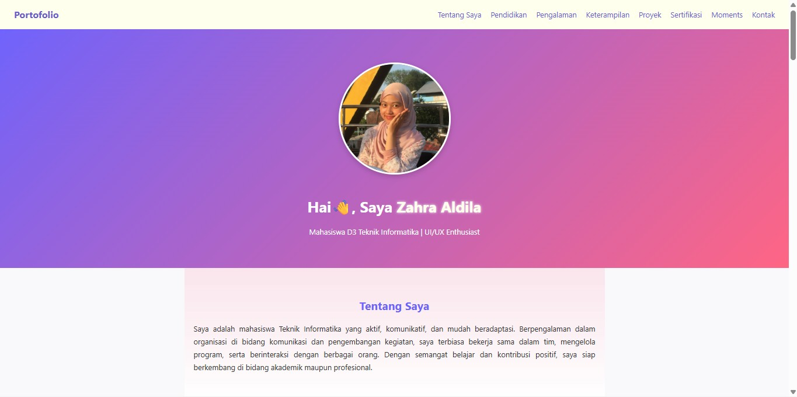

# 🌐 Personal Web Portfolio

## Tampilan Website

## Penjelasan Singkat tentang Proyek
Proyek ini adalah website portofolio pribadi yang menampilkan informasi mengenai data diri, pendidikan, pengalaman, proyek, keterampilan, sertifikasi, serta kontak. Website ini dibuat sebagai bagian dari tugas **Proyek 3 Semester 3**.

## Teknologi yang Digunakan
- HTML5  
- CSS3 (Flexbox, Grid, dan responsive design)  
- JavaScript (untuk interaksi navbar/burger menu)  

## Link Deploy
Website berhasil di-deploy menggunakan **GitHub Pages**.  
🔗 [Klik di sini untuk melihat website](https://zahraldila.github.io/Proyek-3/) 
